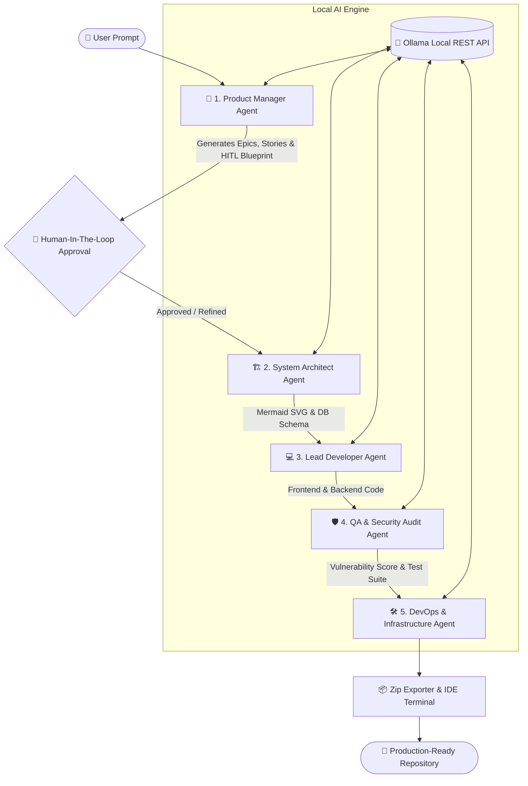

# 🚀 DevSprint — Autonomous Local Multi-Agent Software Engineering & Architecture Platform

[](https://opensource.org/licenses/MIT)
[](https://ollama.ai)
[](https://ollama.ai)
[](#-qa--security-audit-agent)
[](CONTRIBUTING.md)

> **DevSprint** is an enterprise-grade, local-first multi-agent AI workspace that transforms natural language prompts into production-ready software architectures, full-stack codebases, interactive system diagrams, security audits, and deployment manifests—with **zero cloud lock-in** and **100% data privacy**.

---

## 🌟 Key Highlights

- **🔒 100% Privacy & Zero API Costs**: Powered by local open-weight models via **Ollama** (`qwen2.5:1.5b`, `llama3.1`, `deepseek-r1`, `mistral`).
- **⚙️ 5-Agent Collaborative Pipeline**: PM, System Architect, Lead Developer, QA & Security Inspector, and DevOps Engineers work in sequence to generate end-to-end deliverables.
- **🤝 Human-in-the-Loop (HITL)**: Intercept, modify, and fine-tune requirements after the PM blueprint stage before generating code.
- **📊 Interactive Mermaid.js Flowcharts**: Dynamic SVG generation for system architecture, entity relationships, and API flow visualization.
- **🛡️ OWASP Security Scoring**: Automated vulnerability analysis, risk mitigation scoring (0–100), and test suite plan generation.
- **📦 One-Click ZIP Project Export**: Instantly export a complete multi-file project workspace right from the browser.
- **🖥️ Collapsible Execution Terminal**: Embedded IDE console drawer for live pipeline monitoring and command output simulation.

---

## 🏗️ Multi-Agent Architecture



---

## ⚡ Core Feature Matrix

| Feature | Description | Key Tech |
| :--- | :--- | :--- |
| **1. Zip Workspace Exporter** | Export whole project structures into a downloadable `.zip` file with custom READMEs and configuration files. | `JSZip`, `FileSaver.js` |
| **2. Dynamic SVG Mermaid Flowchart** | Renders live system architecture diagrams with pan/zoom capabilities and vector export. | `Mermaid.js`, React Hooks |
| **3. HITL Refinement Mode** | Intercept generation after PM blueprinting to alter tech stack choices, database schemas, or feature sets. | Express HITL Routes, React Modals |
| **4. Multi-Model Selector Dropdown** | Switch between LLMs on the fly (`qwen2.5`, `llama3.1`, `deepseek-r1`, `mistral`, `tinyllama`) depending on local machine capacity. | Ollama `/api/tags` & REST API |
| **5. QA & Security Inspector** | Computes 0–100 security score, flags OWASP risks, and outputs Jest unit tests. | Custom Prompt Rules, JSON Parser |
| **6. IDE Execution Terminal** | Collapsible terminal drawer supporting simulated terminal streams, log outputs, and build status. | Tailwind CSS, React Terminal Component |

---

## 🛠️ Tech Stack

### **Frontend**
- **Framework**: React 18 + Vite
- **Styling**: Tailwind CSS, Lucide Icons, Glassmorphism UI
- **Diagramming & Export**: Mermaid.js, JSZip, FileSaver.js

### **Backend**
- **Runtime**: Node.js & Express (ES Modules)
- **Database & Auth**: MongoDB & Mongoose (JWT Authentication, User & Project Blueprints Persistence)
- **AI Engine**: Local Ollama Server (`/api/chat` with structured JSON mode and AbortController timeout protection)

---

## 🚀 Quick Start Guide

### Prerequisites
1. **Node.js**: v18.0.0 or higher
2. **MongoDB**: Local instance running on `mongodb://localhost:27017/devsprint` or MongoDB Atlas URI
3. **Ollama**: Installed and running locally ([ollama.ai](https://ollama.ai))

### 1. Install & Pull AI Model
Ensure Ollama is running and pull the lightweight high-performance default model:
```bash
ollama pull qwen2.5:1.5b
ollama serve
```

### 2. Clone Repository & Install Dependencies
```bash
git clone https://github.com/Anni27-hub/DevSprint.git
cd DevSprint

# Install root dependencies
npm install

# Install server dependencies
cd server
npm install

# Install client dependencies
cd ../client
npm install
```

### 3. Environment Setup
Create a `.env` file inside the `server/` directory:
```env
PORT=5000
MONGODB_URI=mongodb://localhost:27017/devsprint
JWT_SECRET=your_super_secret_jwt_key_here
OLLAMA_HOST=http://localhost:11434
```

### 4. Run Development Application
Run both frontend and backend concurrently from the project root:
```bash
# From project root directory
npm run dev
```

- **Client**: `http://localhost:5173`
- **Server API**: `http://localhost:5000`

---

## 📂 Project Structure

```text
DevSprint/
├── client/                     # Vite + React Frontend Application
│   ├── src/
│   │   ├── components/         # Modular UI Components & Modals
│   │   │   ├── AgentPipelineVisualizer.jsx
│   │   │   ├── AuthModal.jsx
│   │   │   ├── ExecutionTerminal.jsx
│   │   │   ├── HITLRefinementModal.jsx
│   │   │   ├── MermaidDiagram.jsx
│   │   │   ├── MultiModelSelector.jsx
│   │   │   └── SavedBlueprintsDrawer.jsx
│   │   ├── utils/              # Export utilities (zipExporter.js)
│   │   ├── App.jsx             # Main Application & Router Container
│   │   └── main.jsx
│   ├── package.json
│   └── vite.config.js
├── server/                     # Node.js + Express + Ollama Backend
│   ├── agents/                 # Specialized Multi-Agent Logic
│   │   ├── pmAgent.js
│   │   ├── architectAgent.js
│   │   ├── developerAgent.js
│   │   ├── qaAgent.js
│   │   └── devopsAgent.js
│   ├── models/                 # Mongoose Schemas (User.js, Project.js)
│   ├── routes/                 # Express API Routes & Auth Endpoints
│   ├── middleware/             # JWT & Error Handling Middleware
│   ├── index.js                # Express Application Entrypoint
│   └── package.json
├── scripts/                    # Automated tooling (ensure-ollama.js)
├── package.json                # Root concurrent scripts
└── README.md
```

---

## 🎓 Technical Innovation & Defense Points

- **Guaranteed JSON Output**: Enforces `"format": "json"` in Ollama chat API calls paired with defensive regex cleaning to ensure zero JSON parse failures from small open-weight LLMs.
- **Robust Timeout Resilience**: Implements Node native `fetch` wrapped with an `AbortController` (180s threshold) preventing process lockups during long code generation cycles.
- **Client-Side Heavy Architecture**: Zip creation and SVG flowchart rendering are offloaded entirely to the browser client, keeping the backend lightweight and stateless.

---

## 📄 License

Distributed under the MIT License. See `LICENSE` for more information.

---

<p center="text-align">Crafted with ❤️ for developers by developers.</p>
